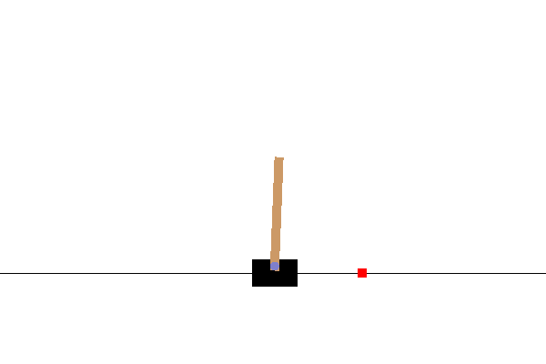
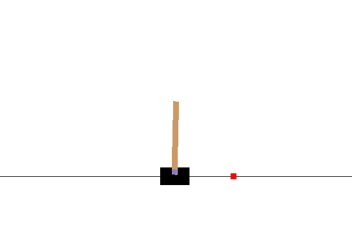
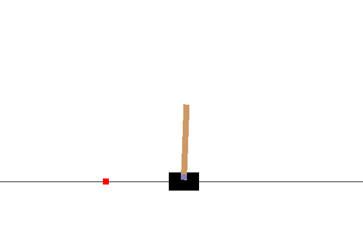

[](https://app.travis-ci.com/cheind/gcsl)
# Vanilla GCSL
This repository contains a vanilla implementation of *"Learning to Reach Goals via Iterated Supervised Learning"* proposed by Dibya Gosh et al. in 2019. 

In short, the paper proposes a learning framework to progressively refine a goal-conditioned imitation policy `pi_k(a_t|s_t,g)` based on relabeling past experiences as new training goals. In particular, the approach iteratively performs the following steps: a) sample new goal `g` and collect experiences using `pi_k(-|-,g)`, b) relabel trajectories such that reached states become surrogate goals (details below) and c) update the policy `pi_(k+1)` using a behavioral cloning objective. The approach is self-supervised and does not necessarily rely on expert demonstrations or reward functions. The paper shows, that training for these surrogate tuples actually leads to desirable goal-reaching behavior.

**Relabeling details** 
Let `(s_t,a_t,g)` be a state-action-goal tuple from an experienced trajectory and `(s_(t+r),a_(t+r),g)` any future state reached within the same trajectory. While the agent might have failed to reach `g`, we may construct the relabeled training objective `(s_t,a_t,s_(t+r))`, since `s_(t+r)` was actually reached via `s_t,a_t,s_(t+1),a_(t+1)...s_(t+r)`. 

**Discussion** Note, by definition, an optimal policy is one that reaches it goals. In this sense, previous experiences where relabeling has been performed constitute optimal self-supervised training data, regardless of the current state of the policy. Hence, old data can be reused at all times to improve the current policy. A potential drawback of this optimality definition is the absence of an *efficient* goal reaching behavior notion. However, the paper (and subsequent experiments) show experimentally that the resulting behavioral strategies are fairly goal-directed.

## About this repository
This repository contains a vanilla, easy-to-understand  PyTorch-based implementation of the proposed method and applies it to an customized Cartpole environment. In particular, the goal of the adapted Cartpole environment is to: a) maintain an upright pole (zero pole angle) and to reach a particular cart position (shown in red). A qualitative performance comparison of two agents at different training times is shown below. Training started with a random policy, no expert demonstrations were used.

||||
|:----------:|:----------:|:------------:|
| 1,000 steps | 5,000 steps | 20,000 steps |

### Dynamic environment experiments
Since we condition our policy on goals, nothing stops us from changing the goals over time, i.e `g -> g(t)`. The following animation shows the agent successfully chasing a moving goal.

<div align="center">

</div>

## Run the code
Install
```
pip install git+https://github.com/cheind/gcsl.git
```
and start training via
```
python -m gcsl.examples.cartpole train
```
which will save models to `./tmp/cartpoleagent_xxxxx.pth`. To evaluate, run
```
python -m gcsl.examples.cartpole eval ./tmp/cartpolenet_20000.pth
```
See command line options for tuning. The above animation for the dynamic goal was created via the following command
```
python -m examples.cartpole eval ^
 tmp\cartpolenet_20000.pth ^
 -seed 123 ^
 -num-episodes 1 ^
 -max-steps 500 ^
 -goal-xmin "-1" ^
 -goal-xmax "1" ^
 --dynamic-goal ^
 --save-gif
```


## References
```bibtex
@inproceedings{
ghosh2021learning,
title={Learning to Reach Goals via Iterated Supervised Learning},
author={Dibya Ghosh and Abhishek Gupta and Ashwin Reddy and Justin Fu and Coline Manon Devin and Benjamin Eysenbach and Sergey Levine},
booktitle={International Conference on Learning Representations},
year={2021},
url={https://openreview.net/forum?id=rALA0Xo6yNJ}
}
```